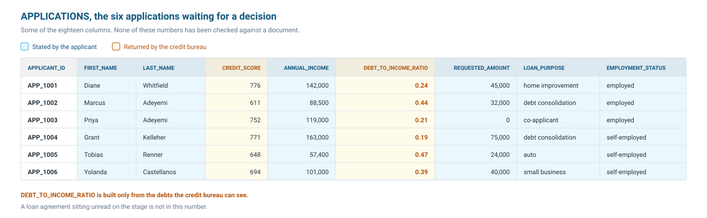

# <h1black>Module 1 — </h1black><h1blue>Understand the Data</h1blue>

The bank runs a lending system where applicants fill in a form and upload the documents that support it. The form becomes a row in the `APPLICATIONS` table, and together with the documents, it is everything the bank has to base a decision on.

Both are already in your database. Let's use CoCo to explore them.

CoCo writes its own query and chooses its own format, so the same question can come back as a table one time and a paragraph the next. Each prompt below says what to expect. Type every prompt into the **CoCo** panel (the chat icon at the bottom right of the screen).

### <h1sub>Step 1.1: Explore the Loan Applications</h1sub>

`APPLICATIONS` holds twenty loan applications. Six of them are still waiting for a decision:



#### 1.1.1 Understand Grant Kelleher's file

!!! action "Ask CoCo to explain Grant Kelleher's loan application"

    ```text
    Look at the APPLICATIONS table.
    Show me Grant Kelleher's loan application and explain what each column tells you about him.
    ```

**What to expect.** CoCo reads the table and walks you through Grant's application. Nothing in the table describes what the columns mean, so it works that out from the names and the values it finds.

#### 1.1.2 Count the loan applications pending a decision

!!! action "Ask CoCo how many loan applications are pending"

    ```text
    How many loan applications are pending a decision?
    ```

**What to expect.** CoCo works out what the columns and the values mean, and should come back with six pending loan applications. It has no business semantics for this table, so it can get this wrong. Module 2 gives an agent the context this table lacks, and you ask the same question there again.

#### 1.1.3 Compare pending with already approved

!!! action "Ask CoCo to compare pending with approved"

    ```text
    Compare the pending loan applications with the ones the bank has already approved.
    Can you compare their average credit score, income, debt-to-income ratio, amount requested and the share who are self-employed?
    Can you show them in a table and tell me some interesting insights?
    ```

**What to expect.** CoCo explores the data, analyses it, and comes back with a comparative table and its own insights into what separates the two groups.

### <h1sub>Step 1.2: Explore the Documents</h1sub>

As part of the loan application, the applicant submits supporting documents: pay stubs, bank statements, tax returns and loan agreements.

#### 1.2.1 Find what each applicant submitted

!!! action "Ask CoCo which documents each applicant submitted"

    ```text
    What documents did the pending applicants upload? Can you show them in a table?
    ```

**What to expect.** CoCo works out that the documents are not in a table at all. They sit on a [stage](https://docs.snowflake.com/en/user-guide/data-load-local-file-system-create-stage), and CoCo lists them and matches each one back to an applicant by file name.

#### 1.2.2 Open Grant Kelleher's documents

!!! action "Ask CoCo for a link to Grant Kelleher's documents"

    ```text
    Can you give me a link to open Grant Kelleher's documents?
    ```

**What to expect.** CoCo generates a [presigned URL](https://docs.snowflake.com/en/user-guide/unstructured-intro) for each of his documents. Open the commercial loan agreement and see what he pays every month, because that is the kind of obligation a credit analyst has to find by reading a document.

---

### <h1sub>Further reading</h1sub>

| Page | What it covers |
|---|---|
| [CoCo overview](https://docs.snowflake.com/en/user-guide/cortex-code/cortex-code) | Everything CoCo can do: SQL, notebooks, agents, dbt and ML workflows. |
| [Cortex AI functions](https://docs.snowflake.com/en/user-guide/snowflake-cortex/aisql) | All the AI\_* SQL functions with examples: classify, extract, summarize and more. |
| [Documents with AI](https://docs.snowflake.com/en/user-guide/snowflake-cortex/ai-documents) | Parse, extract and build RAG pipelines over PDFs and images at scale. |