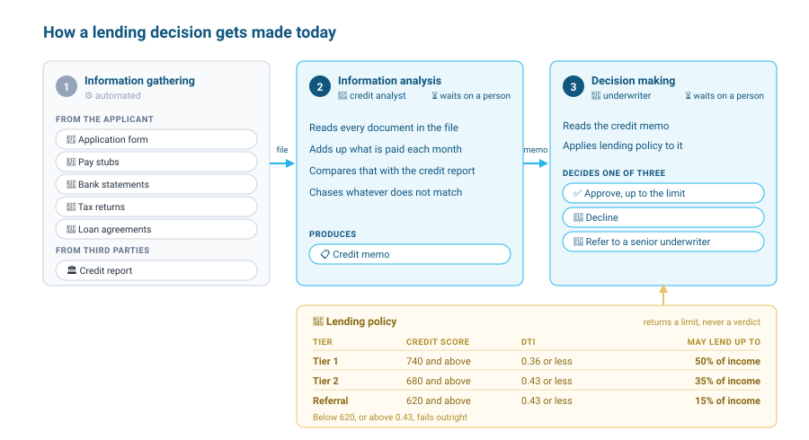

# <h1black>Put Agents to Work — </h1black><h1blue>Automating Business Process</h1blue>

### <h1sub>Why Are We Here?</h1sub>

This lab teaches you how to build agents in Snowflake. We will use bank lending as the example.

You will build them with [CoCo](https://docs.snowflake.com/en/user-guide/cortex-code/cortex-code), an AI agent integrated into the Snowflake platform. It specialises in data engineering, analytics, machine learning and agent-building, and it works directly with your Snowflake environment, with a deep understanding of Snowflake's role-based access control, schemas and best practices.

CoCo is delivered through three experiences: in Snowsight, as a standalone desktop IDE, and as a command line interface. This lab uses CoCo in Snowsight, which is deeply integrated into [Workspaces](https://docs.snowflake.com/en/user-guide/ui-snowsight/workspaces). It knows which SQL file or notebook you are viewing and uses that as background context for its answers, and a diff view lets you review and accept its suggested changes before they are applied.

### <h1sub>Business Processes</h1sub>

Businesses run on processes. Each one assembles people, process and technology to get a piece of work done.

People do most of the work in these processes, for good reasons. Some steps need empathy. Some clearly depend on knowledge that lives in someone's head and was never written down. Some genuinely need a judgement drawn from many complex data points at once.

AI agents have become good at performing complex reasoning over complex data points. This lab focuses on this scenario specifically.

### <h1sub>Bank Lending</h1sub>

Take an example of a bank that lends to consumers and small businesses. Credit risk analysts and underwriters handle thousands of loan applications a week, and the median loan application takes days to decide. The process has three steps.



1. **Information gathering.** The bank collects the applicant's documents and pulls a credit report from the bureau. The bank has already automated this step.

2. **Information analysis.** A credit analyst reads every document in the file and adds up what the applicant pays each month. That total often disagrees with the credit report, so the analyst chases the difference until it is explained. The output is a credit memo.

3. **Decision making.** An underwriter reads the credit memo and applies lending policy to it. Policy sets a lending limit from the credit score and the debt-to-income ratio, which is what the applicant pays on their debts each month divided by their gross monthly income. The underwriter approves up to that limit, declines, or refers the file to a senior underwriter. The policy we use in this lab is simple. A real one has many more rules, but it works the same way: you apply rules to a set of variables to produce a decision.

### <h1sub>Agents</h1sub>

An agent is a language model with a harness around it. The harness turns a model into an agent. The model reasons, takes an action by calling a tool, observes the result, and repeats until the task is done.

A harness makes an agent more reliable. A model on its own can give you an answer that sounds right and is wrong.

![A circuit board with a chip at the centre labelled model. Six boxes connect to it. Context holds the semantic view, the instructions and the thread. Retrieve holds Cortex Analyst over structured data and Cortex Search over documents. Act holds custom tools and other agents. Control holds the budget, turn limits and when to escalate to a person. Observe holds traces, spans and evaluation runs. Persist holds the credit memo, the decision on the loan application and the underwriting log. A boundary around the six is labelled harness, and a band around that is labelled governance: role-based access control, and policy enforced outside the model.](assets/00-harness.svg)

The harness has six parts.

**Context.** The model sees only what you give it: instructions, the meaning of the data, and the conversation so far.

**Control.** You set how long the agent can run, how many steps it can take, and when it should stop and hand the work to a person.

**Observe.** A trace shows you every step the agent took to answer one question. An evaluation scores its answers across many questions, so you can tell whether a change helped.

**Retrieve.** The agent reads the data it needs. Some of that data is in tables, and some of it is in documents.

**Act.** The agent calls a tool to do something a model cannot do by itself, like running a calculation or saving a result. A tool can also be another agent.

**Persist.** The agent stores its results so they last beyond the conversation. Other people and other agents can then read them.

A band of governance wraps all six parts. The agent runs as a Snowflake role — it only sees what that role can see. Business rules run as code outside the model, so the model cannot go beyond what they allow.

In this lab we build two agents, one for each step that needs a person today.

**A credit analyst agent.** It reads the documents in the file, finds obligations the credit report does not carry, recomputes the debt-to-income ratio, and writes a credit memo.

**An underwriting agent.** It reads the memo, applies lending policy, and records a decision: approve up to the limit, decline, or escalate to a human.

You will build both with CoCo in Snowsight.

### <h1sub>The Lab Environment</h1sub>

The lab runs in [Snowsight](https://docs.snowflake.com/en/user-guide/ui-snowsight), on your own Snowflake trial account. Setup takes three steps and about two minutes.

!!! action "Step 1: Let Snowflake read the lab repository"

    1. Select **Projects** » **Workspaces** in the left navigation.
    2. Select **+ Add new** » **SQL File**.
    3. Paste the statement below and select **Run**.

    ```sql
    CREATE API INTEGRATION LAB_GIT_API
        API_PROVIDER = git_https_api
        API_ALLOWED_PREFIXES = ('https://github.com/neelsengupta/')
        ENABLED = TRUE;
    ```

!!! action "Step 2: Create the lab workspace"

    1. Open the workspace menu at the top left of the file list and select **From Git repository**.
    2. For **Repository URL**, paste `https://github.com/neelsengupta/snowflake-agentic-lending-lab`.
    3. Leave the workspace name as it is.
    4. For **API Integration**, select **LAB_GIT_API**.
    5. Select **Public repository**, then **Create**.

!!! action "Step 3: Run the setup"

    1. In the new **snowflake-agentic-lending-lab** workspace, open **setup.sql**.
    2. Select **Run All**.

**What to expect.** About a minute later, the last result is a single row ending in `Setup complete`, with 12 documents parsed, 5 applicants with documents, and 3 search results. If it says `Setup incomplete`, a column that is lower than that tells you which part did not finish.

Your workspace holds the files for the rest of the lab: **lab.sql** has all the SQL you run, **cortex_project/** holds the agent YAML files, and **utils/** has a reset script and helpful queries. CoCo is the panel on the right.

Throughout the lab you use one warehouse, `LENDING_WH`, and one schema, `LENDING.LOANS`. You stay in the **ACCOUNTADMIN** role your trial signs you in with. That keeps setup short. In production the agents would run under a role that can see only these objects, and that role is what governs what they read and do.

### <h1sub>Lab Exercise</h1sub>

The lab is divided into modules. Run them in order, because each one builds on the last.


| Module | Contents |
|--------|----------------|
| [1. Understand the Data](module-1.md) | Explore the loan applications and documents uploaded using CoCo |
| [2. Explore the Reasoning Layer](module-2.md) | Explore how analytics and search work, and what an agent gets from each |
| [3. Build the Credit Analyst Agent](module-3.md) | Build an agent that reads the documents, then measure every change against an evaluation |
| [4. Explore the Underwriting Agent](module-4.md) | Explore a pre-built agent that applies policy to the memo, and calls the credit analyst through MCP when no memo exists |
