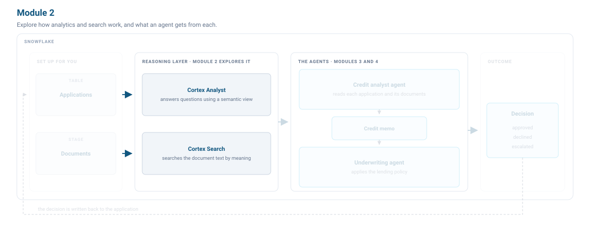
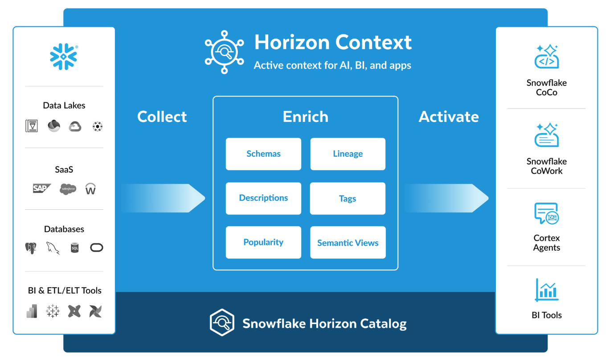
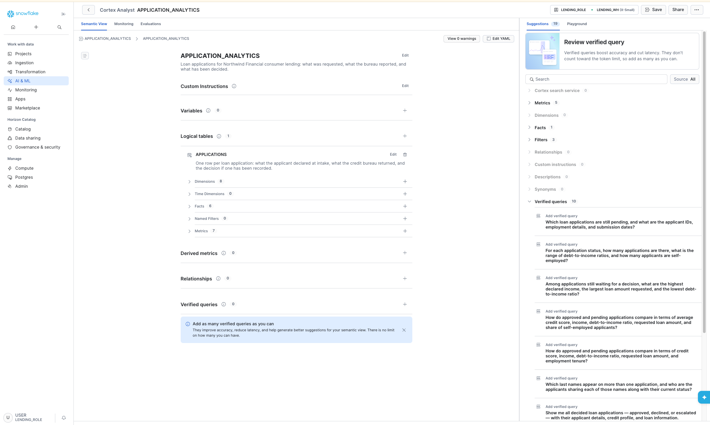
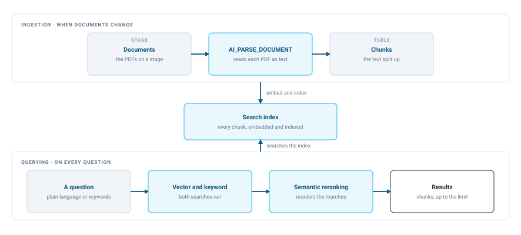
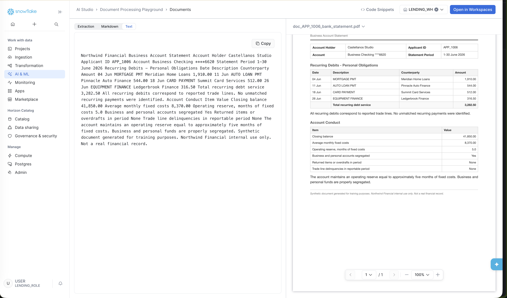
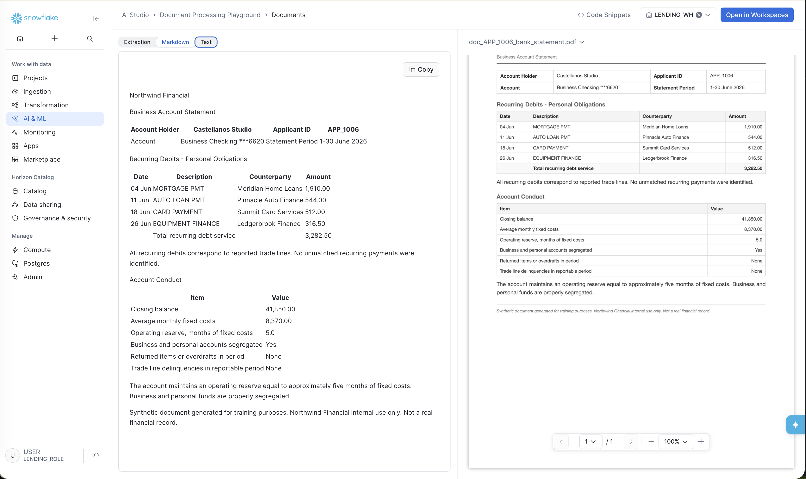
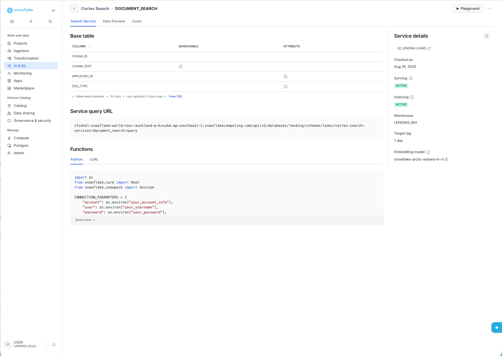
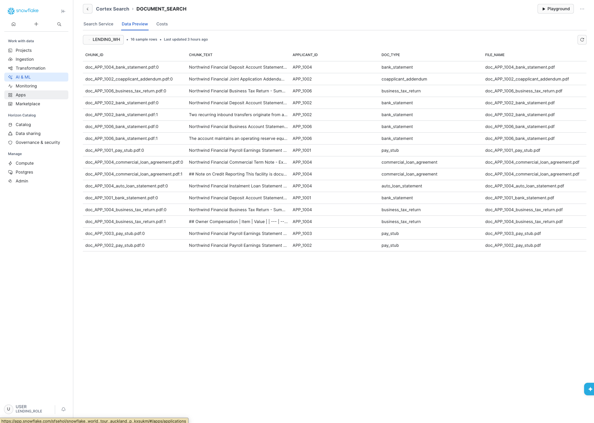
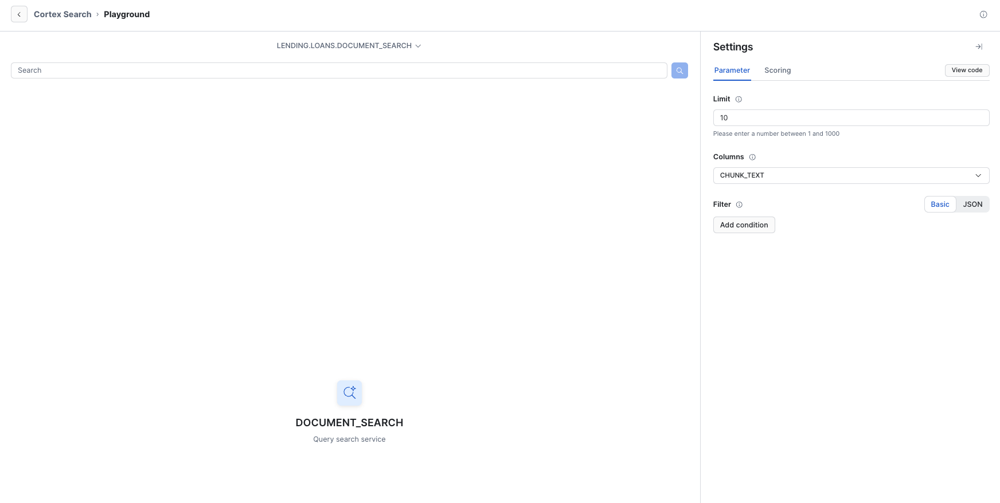

# <h1black>Module 2 — </h1black><h1blue>Explore the Reasoning Layer</h1blue>

Picture a credit risk analyst. They review all the information an applicant submits in the form, what the credit bureau sends about the applicant, and the documents the applicant submits. They analyse every detail to produce a memo of the key information. You then check that memo against policy to make a lending decision. The evidence lives across structured records and unstructured documents, and the reasoning that ties them together is the hard part.

So an agent needs two capabilities: analytics to answer questions about the numbers, and search to make sense of the documents. Every agent that reasons over complex data rests on those two. In the harness, these two together make up **Retrieve**.

In Snowflake these two building blocks are [Cortex Search](https://docs.snowflake.com/en/user-guide/snowflake-cortex/cortex-search/cortex-search-overview) and [Cortex Analyst](https://docs.snowflake.com/en/user-guide/snowflake-cortex/cortex-analyst). Both come as REST APIs, and you can expose either to MCP clients such as Claude or Cursor through a [Snowflake-managed MCP server](https://docs.snowflake.com/en/user-guide/snowflake-cortex/cortex-agents-mcp).



Both tools are part of Snowflake's governed context layer — a platform for collecting data from any source, enriching it with schemas, descriptions, and semantic views, and activating it through agents, CoCo, and BI tools. The quality of what an agent retrieves directly drives its quality, cost, and latency.

Setup built both in your account. This module shows you what each one gives an agent and how to check that it works before an agent depends on it. An agent retrieves through these two and nothing else: tables through Cortex Analyst, documents through Cortex Search.

### <h1sub>Step 2.1: Understand the Analyst</h1sub>

In Module 1 you asked CoCo how many loan applications were pending. CoCo answered it by mostly guessing what the table and columns meant. While agents can answer questions directly from your data, they struggle to be accurate without further context about the data itself. Our [experiments](https://www.snowflake.com/en/blog/enterprise-ai-agents-grounded-context/) show that agents are two to four times more accurate on hard questions when they have access to context and business semantics. Snowflake ships a context layer called [Horizon Context](https://www.snowflake.com/en/product/features/horizon-context/) that adds governed meaning to your data.



A [semantic view](https://docs.snowflake.com/en/user-guide/views-semantic/overview) is how you store that meaning in Snowflake. It is a schema-level object where you define business metrics, model business entities, and describe the relationships between them. Because the view adds business meaning to physical data, every agent and application that queries it reads the same definitions, so two agents cannot disagree about what income means.

#### 2.1.1 Explore the semantic view

The semantic view built for this lab is called `APPLICATION_ANALYTICS`. Let's look at it.

!!! action "Open the semantic view"

    1. In the left navigation, select **AI & ML** » **Analyst**.
    2. Set the database to `LENDING` and the schema to `LOANS` if they are not already set.
    3. Select `APPLICATION_ANALYTICS`. This opens it in the [Semantic View Editor](https://docs.snowflake.com/en/user-guide/views-semantic/editor).



The view has one logical table over the `APPLICATIONS` table. Expand it and you see eight dimensions, six facts and seven metrics. Dimensions are the attributes you group and filter by, such as status and loan purpose. Facts are the row-level numbers, such as credit score and the debt-to-income ratio. Metrics are the aggregations, such as an average credit score or a total approved amount.

Read the descriptions. Cortex Analyst reads this definition and writes SQL against the underlying tables, so it reasons from those descriptions.

The **Suggestions** panel on the right lists things Snowflake thinks would make the view better, including verified queries. This view has none yet.

#### 2.1.2 Ask questions in the playground

The Playground lets you ask the semantic view a question in plain language and see what Cortex Analyst does with it.

!!! action "Ask Cortex Analyst how many loan applications are pending"

    1. Select the **Playground** tab, at the top of the panel on the right.
    2. Ask:

        ```text
        How many loan applications are pending a decision?
        ```

**What to expect.** Six pending loan applications. You also get the SQL that Cortex Analyst wrote.

!!! action "Ask Cortex Analyst to compare pending with approved"

    In the **Playground** tab (still open from the previous step), ask:

    ```text
    Compare the pending loan applications with the ones already approved.
    Average credit score, income, debt-to-income ratio, and the share who are self-employed.
    ```

**What to expect.** It returns the comparison you asked CoCo for in Module 1, this time built from the metrics defined in the view.

### <h1sub>Step 2.2: Understand Search</h1sub>

The other half of the analyst's job is reading documents. The applicant submits bank statements, tax returns, loan agreements and pay stubs, and the facts that matter live inside those documents. Cortex Search gives you hybrid search over that text.

Cortex Search runs hybrid search, combining vector and keyword matching, over text in Snowflake. It handles the embedding, the index and the refreshes, so it needs no tuning or maintenance. The same service also powers RAG applications you build on large language models.

Setup built a search service for this lab, called `DOCUMENT_SEARCH`. It indexes the documents you looked at in Module 1.

The documents have to be read, chunked and indexed before anyone asks anything, and re-indexed whenever a document changes. Every question then searches that index.



#### 2.2.1 Turn a PDF into text

The PDFs on the stage need to be ingested and their text extracted. Snowflake's AI functions make this easy — `AI_PARSE_DOCUMENT` reads and parses these documents. Setup ran this pipeline for you, but you can try it yourself in the Document Processing Playground.

!!! action "Parse a document"

    1. In the left navigation, select **AI & ML** » **AI Studio** » **Document Processing Playground**.
    2. Select **Add from stage**. Set the database to `LENDING` and the schema to `LOANS` if they are not already set, then choose the `LAB_FILES` stage.
    3. Pick a bank statement and select **Open playground**. The PDF appears on the right.
    4. Select the **Text** tab.



The **Text** tab shows the OCR mode output of `AI_PARSE_DOCUMENT`. OCR mode does not preserve layout, so the amounts arrive without the rows they belong to.

!!! action "Switch to Markdown"

    Select the **Markdown** tab.



The **Markdown** tab shows the LAYOUT mode output, which keeps the tables, so each transaction still sits in a row with its description and its amount. [AI_PARSE_DOCUMENT](https://docs.snowflake.com/en/user-guide/snowflake-cortex/parse-document) has these two modes, and the pipeline for this lab used LAYOUT.

Then `SPLIT_TEXT_RECURSIVE_CHARACTER` splits the parsed text into smaller chunks. Each chunk becomes one row in `LENDING.LOANS.DOCUMENT_CHUNKS`. If you want to see what was indexed, open the **Databases** tab beside your workspace, navigate to `LENDING » LOANS » DOCUMENT_CHUNKS`, and select **Data Preview**.

#### 2.2.2 Explore the search service

!!! action "Open the search service"

    In the left navigation, select **AI & ML** and then **Search**, and select `DOCUMENT_SEARCH`.



The search service uses the `CHUNK_TEXT` column to search. `APPLICANT_ID` and `DOC_TYPE` are attribute columns, so you can filter a search by applicant or by document type.

!!! action "Look at the indexed chunks"

    Select the **Data Preview** tab.



Each row is one chunk. The chunk ID is the file name with the chunk's position appended.

#### 2.2.3 Search the documents in the playground

!!! action "Open the search playground"

    1. Select **Playground** in the top right corner.
    2. Under **Columns** in the Settings panel, add `APPLICANT_ID`, `DOC_TYPE` and `FILE_NAME`, so each result tells you whose document it came from.

You can type a question in plain language or just keywords. Both work.



!!! action "Ask Cortex Search for a personal guarantee"

    In the **Cortex Search Playground** (still open from the previous step), type:

    ```text
    Is any applicant personally liable for a business loan?
    ```

**What to expect.** A commercial term note comes back first, followed by other documents from the same applicant.

### <h1sub>What we built</h1sub>

You have explored the Retrieve part of the harness. Cortex Analyst answers structured questions through the semantic view `APPLICATION_ANALYTICS`. Cortex Search finds facts in documents through `DOCUMENT_SEARCH`.

In Module 3 you build a credit analyst agent. When it calls `application_analytics`, it goes through Cortex Analyst with the view you just explored. When it calls search, it goes through `DOCUMENT_SEARCH`. You have seen what both return before the agent depends on them.

---

### <h1sub>Further reading</h1sub>

| Page | What it covers |
|---|---|
| [Overview of semantic views](https://docs.snowflake.com/en/user-guide/views-semantic/overview) | Define business metrics and dimensions for natural-language queries. |
| [Best practices for semantic views](https://docs.snowflake.com/en/user-guide/views-semantic/best-practices-modeling) | What makes a semantic view accurate and how large it should get. |
| [Cortex Search](https://docs.snowflake.com/en/user-guide/snowflake-cortex/cortex-search/overview) | Hybrid search over unstructured text: how indexing and retrieval work. |
| [AI_PARSE_DOCUMENT](https://docs.snowflake.com/en/sql-reference/functions/ai_parse_document) | Turn PDFs and images into structured text at scale. |

