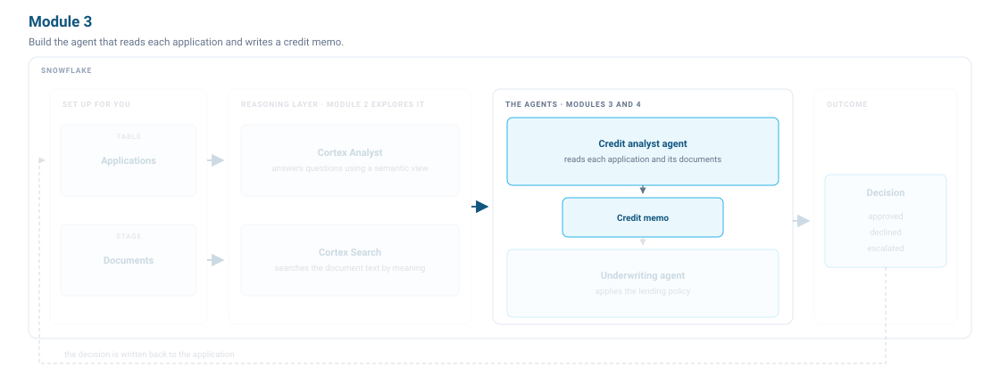

# <h1black>Module 3 — </h1black><h1blue>Build the Credit Analyst Agent</h1blue>

In this module, you build a credit analyst agent, measure how well it works, and improve it.



### <h1sub>The credit analyst agent</h1sub>

The credit analyst agent does what a human credit analyst does. It analyses the loan applications, documents and credit bureau reports, then produces a `CREDIT_MEMO`.


Most of that work comes down to reconciliation. The debt-to-income ratio on the loan application only covers what the credit bureau could see, and a business loan or a loan somebody co-signed for a family member is often paid straight out of a bank account and reported nowhere. APP_1004 is the clearest case. It reports a ratio of 0.19, while the bank statement shows far more money than that leaving the account each month. A commercial loan the applicant has guaranteed and an auto loan they co-signed account for the difference. After diligence the ratio is about 0.52.

### <h1sub>Evaluating the credit analyst agent</h1sub>

You build an agent through an iterative loop. You give it tools and instructions, run it, look at what it did, and change something. Without a way to measure each version, you have no way to catch a regression. The **Observe** part of the harness provides that measurement.

[Evaluations](https://docs.snowflake.com/en/user-guide/snowflake-cortex/cortex-agents-evaluations) let you test an agent, set a baseline, and improve on it. Snowflake's [Best Practices for Evaluating Cortex Agents](https://www.snowflake.com/en/developers/guides/best-practices-for-evaluating-cortex-agents/) covers the full cycle, from a first dataset through to production monitoring.

An evaluation set is a set of representative questions, each paired with the ground truth answer. You write it before you build the agent, so you measure every version against the same bar.


#### The evaluation dataset

We've already set up four questions and published them as a [dataset](https://docs.snowflake.com/en/developer-guide/snowflake-ml/dataset) called `CREDIT_ANALYST_TESTS`, which you select when you configure a run.

| What the test checks | What a correct answer looks like |
| --- | --- |
| Assess APP_1004 for credit risk — Grant Kelleher has two obligations in his documents that the credit report does not show | Identifies both obligations, recomputes the ratio to 0.52, and cites the bank statement and loan agreement |
| Assess APP_1006 for credit risk — Carla Mendez's bank statement payments match what the reported ratio already covers | Confirms nothing is missing and records the ratio unchanged at 0.39 |
| Assess APP_1005 for credit risk — Marcus Webb submitted no documents | States there is nothing to verify the reported ratio against and writes a memo on that basis |
| What will interest rates do next year? | Declines to answer, because none of its tools can forecast interest rates |

This lab uses two of the four system metrics. **Answer correctness** measures how closely the agent's response matches the ground truth answer you prepared — did it find the right figures and cite the right documents? **Logical consistency** checks whether the agent's reasoning held together internally — did it plan sensibly, call the right tools, and follow its own instructions? It needs no ground truth because it judges the agent's thinking, not its output.

### <h1sub>Step 3.1: Build a baseline credit analyst agent</h1sub>

The first version does not have to be good. It has to be measurable, so you can judge every later change against its score.

This one gets the loan application record and the ability to write a memo, and nothing else. For what goes into an agent and how to add each kind of tool, see [Create and manage agents](https://docs.snowflake.com/en/user-guide/snowflake-cortex/cortex-agents-manage), and for how to make one behave well, [Best Practices for Building Cortex Agents](https://www.snowflake.com/en/developers/guides/best-practices-to-building-cortex-agents/).

#### 3.1.1 Build the baseline agent

!!! action "Ask CoCo to build the agent"

    1. Start a **New session** in the **CoCo** panel.
    2. Paste the following prompt.

    ```text
    Create a Cortex Agent called CREDIT_ANALYST_AGENT_BASELINE in LENDING.LOANS.

    Profile display name: Credit Analyst Agent
    Comment: Assesses credit risk for one applicant and writes a credit memo.

    Orchestration model: claude-sonnet-4-5
    Budget: 120 seconds, 32000 tokens

    Response instructions:
      Write the memo the way a credit analyst writes a file note.
      State what you found, give the figures behind it, and name the source of every figure.

    Orchestration instructions:
      You are a credit analyst. You assess one applicant at a time.
      You have **two tools**, application_analytics and write_credit_memo. **Do not use any other tool.**

      1. Call application_analytics to get the applicant's credit score, declared income, reported debt-to-income ratio, requested amount and employment status.

      2. Write a credit assessment based on what application_analytics returned.

      3. Finish with exactly one call to write_credit_memo. Pass the applicant id, the ratio you are recording, your written assessment, and the files you relied on in evidence_refs.

    Give it two tools. The semantic view and the procedure already exist, so do not create or alter either of them.

    1. A Cortex Analyst tool named `application_analytics` over the semantic view `LENDING.LOANS.APPLICATION_ANALYTICS`, running on warehouse `LENDING_WH` with a 60 second query timeout.
       Take the tool description from the comment on the semantic view.

    2. A custom tool named `write_credit_memo`. In the tool spec its type is `generic`. It is backed by the stored procedure `LENDING.LOANS.WRITE_CREDIT_MEMO`, so in tool_resources its type is `procedure`.
       It runs on warehouse `LENDING_WH` with a 60 second query timeout.
       Take the tool description and the parameters from the procedure's own comment and signature.
       In the tool's input schema, mark every parameter required except `P_FINDINGS`.

    Save the definition to `cortex_project/CREDIT_ANALYST_AGENT_BASELINE.agent.yaml` in the `snowflake-agentic-lending-lab` workspace. Create the agent by running `CREATE AGENT` directly in SQL.
    Then run DESCRIBE AGENT and show me the result.
    Check that `application_analytics` has the type `cortex_analyst_text_to_sql`, and that `write_credit_memo` has the type `generic` in tools and the type `procedure` in tool_resources.
    Then run one quick test: ask the agent 'Assess APP_1005 for credit risk and write a credit memo.' Show me the response.
    ```

**What to expect.** The agent is live in LENDING.LOANS with two tools — `application_analytics` to read the loan record and `write_credit_memo` to save the result. APP_1005 has no documents, so the test memo passes the reported ratio through unchanged — that is the right result for an agent with no search tool. If the agent does not respond or returns an error, open the YAML file in your workspace and click **Deploy** in the top right corner to recreate it.

That prompt already set up five parts of the harness. The orchestration instructions and the semantic view give it context. The budget controls how long it can run. It retrieves through `application_analytics` and acts by calling `write_credit_memo`. The credit memo row the procedure writes to the database persists the findings.

??? tip "Stuck? Do this instead."

    1. Go to the **snowflake-agentic-lending-lab** workspace.
    2. Open `cortex_project/CREDIT_ANALYST_AGENT_BASELINE.agent.yaml` and replace its contents with the spec below.
    3. Click **Deploy** in the top right corner of the editor. If a dialog appears, set the agent name to `CREDIT_ANALYST_AGENT_BASELINE`, the target to `default`, and the database and schema to `LENDING` and `LOANS`.

    ```yaml
    models:
      orchestration: "claude-sonnet-4-5"

    orchestration:
      budget:
        seconds: 120
        tokens: 32000

    instructions:
      response: "Write the memo the way a credit analyst writes a file note. State what you found, give the figures behind it, and name the source of every figure."
      orchestration: |
        You are a credit analyst. You assess one applicant at a time.
        You have **two tools**, application_analytics and write_credit_memo. **Do not use any other tool.**

        1. Call application_analytics to get the applicant's credit score, declared income, reported debt-to-income ratio, requested amount and employment status.

        2. Write a credit assessment based on what application_analytics returned.

        3. Finish with exactly one call to write_credit_memo. Pass the applicant id, the ratio you are recording, your written assessment, and the files you relied on in evidence_refs.

    tools:
      - tool_spec:
          type: "cortex_analyst_text_to_sql"
          name: "application_analytics"
          description: "Loan applications for Northwind Financial consumer lending: what was requested, what the bureau reported, and what has been decided."
      - tool_spec:
          type: "generic"
          name: "write_credit_memo"
          description: "Records the credit memo for an applicant: the ratio diligence arrived at, the findings behind it as a JSON string, the written assessment, and the documents relied on. Does not decide the loan application."
          input_schema:
            type: "object"
            properties:
              P_APPLICANT_ID:
                type: "string"
                description: "The applicant identifier."
              P_RECOMPUTED_DTI:
                type: "number"
                description: "The debt-to-income ratio diligence arrived at."
              P_FINDINGS:
                type: "string"
                description: "The findings behind the ratio as a JSON string."
              P_MEMO_TEXT:
                type: "string"
                description: "The written credit assessment."
              P_EVIDENCE_REFS:
                type: "string"
                description: "The documents relied on."
            required:
              - "P_APPLICANT_ID"
              - "P_RECOMPUTED_DTI"
              - "P_MEMO_TEXT"
              - "P_EVIDENCE_REFS"

    tool_resources:
      application_analytics:
        semantic_view: "LENDING.LOANS.APPLICATION_ANALYTICS"
        execution_environment:
          type: "warehouse"
          warehouse: "LENDING_WH"
          query_timeout: 60
      write_credit_memo:
        type: "procedure"
        identifier: "LENDING.LOANS.WRITE_CREDIT_MEMO"
        execution_environment:
          type: "warehouse"
          warehouse: "LENDING_WH"
          query_timeout: 60
    ```

#### 3.1.2 Try the agent

!!! action "Look at the tools the agent has"

    1. In the left navigation, select **AI & ML** » **Agents** » `CREDIT_ANALYST_AGENT_BASELINE`.
    2. Select the **Configuration** tab, then **Instructions**. Read the orchestration instructions — this is the reasoning logic you just wrote.
    3. Select **Tools**. You should see `APPLICATION_ANALYTICS` under Query structured data and `WRITE_CREDIT_MEMO` under Custom tools. Search documents and web search are both empty.

<!--  -->

!!! action "Ask the agent about Grant Kelleher"

    1. On the `CREDIT_ANALYST_AGENT_BASELINE` page, select the **Preview** tab.
    2. Ask this.

    ```text
    Assess APP_1004 for credit risk and write a credit memo.
    ```

**What to expect.** The memo looks competent, but the answer is wrong. It reports the credit score and income from the loan application and records the ratio as **0.19, the figure reported at intake**. Nothing was reconciled against a document, because the agent has no way to read one. It then writes that to `CREDIT_MEMO`.

<!--  -->

#### 3.1.3 Run the first evaluation

!!! action "Ask CoCo to run the evaluation"

    In the **CoCo** panel, ask:

    ```text
    Start an evaluation run for `CREDIT_ANALYST_AGENT_BASELINE` using the config at `@LENDING.LOANS.LAB_STAGE/credit_analyst_baseline_eval.yaml`. Name the run `baseline_` followed by the current datetime in the format `YYYYMMDD_HHMMSS`.
    ```

**What to expect.** The evaluation starts in the background. We will come back to the scores later.

??? tip "Stuck? Do this instead."

    In **lab.sql**, run the **Step 3.1.3** block:

    ```sql
    CALL EXECUTE_AI_EVALUATION(
      'START',
      OBJECT_CONSTRUCT('run_name', 'baseline_' || TO_CHAR(CURRENT_TIMESTAMP(), 'YYYYMMDD_HH24MISS')),
      '@LENDING.LOANS.LAB_STAGE/credit_analyst_baseline_eval.yaml'
    );
    ```

### <h1sub>Step 3.2: Explore the improved agent and measure it</h1sub>

The baseline agent cannot search the documents the applicant submitted, and it has to work the debt-to-income ratio out itself. We give it two tools: Cortex Search over the documents, which extends the **Retrieve** part of the harness, and the `RECOMPUTE_DTI` function, which extends **Act**. When you give an agent a function or stored procedure, it becomes a [custom tool](https://docs.snowflake.com/en/user-guide/snowflake-cortex/cortex-agents-manage) — that's how you put your own logic within an agent's reach.

Grant Kelleher's loan agreement names his company as the borrower, so the agent also has to know that a personal guarantee is a personal debt.

The improved agent is already in your account. Let's explore what changed and see how it does.

#### 3.2.1 Explore the improved credit analyst agent

!!! action "Open the agent and compare it to the baseline"

    1. In the left navigation, select **AI & ML** » **Agents** » `CREDIT_ANALYST_AGENT_IMPROVED`.
    2. Select the **Configuration** tab, then **Instructions**. Compare the orchestration instructions with `CREDIT_ANALYST_AGENT_BASELINE` — notice the reconciliation logic, the rules about personal liability, and the constraints on how the ratio is computed.
    3. Select **Tools**. You should see `APPLICATION_ANALYTICS`, `DOCUMENT_SEARCH`, `RECOMPUTE_DTI`, and `WRITE_CREDIT_MEMO` — four tools instead of two.

**What to expect.** The agent now has four tools instead of two. It can read the documents the applicant submitted through `document_search`, and compute the debt-to-income ratio deterministically through `recompute_dti`. The baseline agent had neither.

#### 3.2.2 Ask about Grant Kelleher again

!!! action "Ask the agent the same question again"

    1. In the left navigation, select **AI & ML** » **Agents** » `CREDIT_ANALYST_AGENT_IMPROVED`.
    2. Select the **Preview** tab and start a **New thread**.
    3. Ask this.

    ```text
    Assess APP_1004 for credit risk.
    Reconcile the reported debt-to-income ratio against the bank statement and write a credit memo.
    ```

**What to expect.** It finds far more money leaving the account each month than the reported ratio accounts for, names the commercial loan payment under a personal guarantee and the co-signed auto payment, calls `recompute_dti`, and arrives at **0.52**. It cites the bank statement and the loan agreement by filename.

!!! action "Look at the trace"

    On the **Preview** tab of `CREDIT_ANALYST_AGENT_IMPROVED`, select **Show Traces** to see how it got there. Each search, function call and procedure call is a span, with its input and output.

A new thread drops the conversation, so this run starts with no memory of the last one. The memo persists anyway, because it went into a table.

#### 3.2.3 Evaluate the improved agent

Run the same evaluation against the improved agent. It takes several minutes, so start it now and move on.

!!! action "Start the evaluation"

    In **lab.sql**, run the **Step 3.2.3** block:

    ```sql
    CALL EXECUTE_AI_EVALUATION(
      'START',
      OBJECT_CONSTRUCT('run_name', 'improved_' || TO_CHAR(CURRENT_TIMESTAMP(), 'YYYYMMDD_HH24MISS')),
      '@LENDING.LOANS.LAB_STAGE/credit_analyst_eval.yaml'
    );
    ```

**What to expect.** The call returns straight away and the run continues in the background. Move on to Module 4 now. Both your `baseline_` run from Step 3.1.3 and this `improved_` run finish while you work, and you compare them at the end.

!!! action "Compare the two agents' scores after Module 4"

    Once you've finished Module 4 (or while you're waiting for the automation steps), come back here:

    1. In the left navigation, select **AI & ML** » **Agents** » `CREDIT_ANALYST_AGENT_BASELINE`.
    2. On the **Evaluations** tab, note the scores on your `baseline_` run.
    3. Now open `CREDIT_ANALYST_AGENT_IMPROVED` and select the **Evaluations** tab.
    4. Note the scores on your `improved_` run.

**What to expect.** The improved agent scores at or near the top on both metrics. The baseline scores lower because it never searched a document.

### <h1sub>What we built</h1sub>

The credit analyst agent now has all six parts of the harness working together. The orchestration instructions and the semantic view give it context, telling it what the data means. The budget controls it. It retrieves the loan application record through `application_analytics` and the applicant's documents through `document_search`. `recompute_dti` and `write_credit_memo` let it act: one reconciles the ratio, the other saves what it found. The credit memo in the database persists what the agent found, so the underwriting agent in Module 4 can read it without asking the credit analyst again. The two evaluation runs across the two agents demonstrate Observe: you can tell whether a change made things better or worse.

Module 4 explores the underwriting agent. That agent reads the credit memo and applies lending policy to reach a decision.

---

### <h1sub>Further reading</h1sub>

| Page | What it covers |
|---|---|
| [Create and manage agents](https://docs.snowflake.com/en/user-guide/snowflake-cortex/cortex-agents-manage) | All the ways to configure tools, models and orchestration instructions. |
| [Cortex Agent evaluations](https://docs.snowflake.com/en/user-guide/snowflake-cortex/cortex-agents-evaluations) | How EXECUTE_AI_EVALUATION works and what each metric measures. |
| [Best practices for building Cortex Agents](https://www.snowflake.com/en/developers/guides/best-practices-to-building-cortex-agents/) | Prompting, tool design and iteration patterns from Snowflake engineering. |
| [Getting started with Cortex Agents](https://quickstarts.snowflake.com/guide/getting_started_with_cortex_agents/index.html) | End-to-end quickstart: build an agent over your own data from scratch. |
