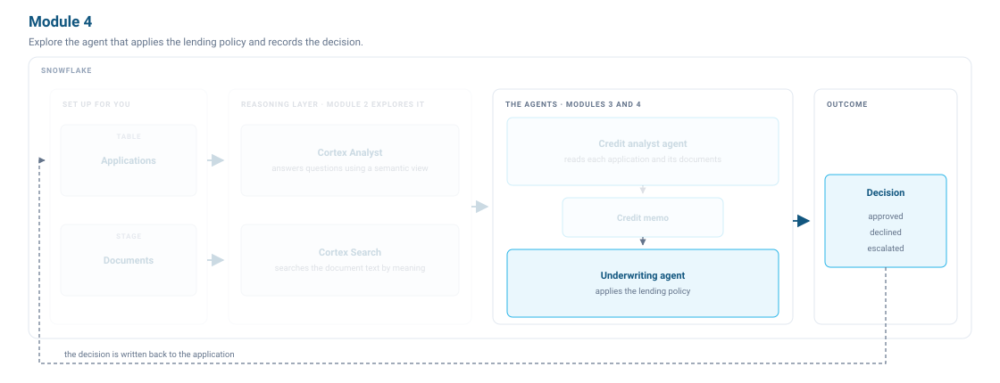

# <h1black>Module 4 — </h1black><h1blue>Explore the Underwriting Agent</h1blue>

In Module 3 we built a credit analyst that reads a loan application and its documents and writes a credit memo. A memo is not a decision. Deciding is the underwriter's job. In this module we explore two pre-built underwriting agents and see how multi-agent orchestration over MCP works in practice.



The underwriter reads the credit memo, tests it against the policy, and gives a decision. Sometimes the underwriter picks up a loan application nobody has assessed yet. Then the agent asks the credit analyst for a memo first, over a [Snowflake-managed MCP server](https://docs.snowflake.com/en/user-guide/snowflake-cortex/cortex-agents-mcp).

![The underwriting agent takes the credit memo and the loan application record. It looks for a memo on the applicant, asks the credit analyst when there is none, tests the credit score and the debt-to-income ratio against policy, then approves within the limit, declines, or escalates, and records the decision on the loan application. Below it sit the two things it calls. The lending policy is the POLICY_CHECK function, run on the ratio the memo established, with three tiers: TIER_1 at a score of 740 or above and a ratio of 0.36 or below, permitting 50 percent of income; TIER_2 at 680 or above and 0.43 or below, permitting 35 percent; and REFERRAL for anything else, permitting 15 percent. The other is the credit analyst agent built in Module 3, reached over a Snowflake-managed MCP server. For APP_1004 the output is a status of DECLINED at tier REFERRAL, a maximum exposure of 24,450 and an approved amount of zero, where the ratio reported at intake would have made the same file TIER_1 and eligible for the full 75,000.](assets/04-underwriter.svg)

The `POLICY_CHECK` function turns the credit score and the ratio into a tier, and the tier caps lending at a share of income.

| Tier | Requires | Lending limit |
| --- | --- | --- |
| `TIER_1` | a score of 740 or above and a ratio of 0.36 or below | 50% of income |
| `TIER_2` | a score of 680 or above and a ratio of 0.43 or below | 35% of income |
| `REFERRAL` | anything that meets neither | 15% of income |

Two checks fail a file outright: a score below 620, or a ratio above 0.43. A good score does not rescue a file from a ratio above the maximum.

If a check fails, the file goes to a senior underwriter. Either way the agent records the outcome with `RECORD_DECISION`, which runs the policy check itself, so it enforces the cap outside the model. Running the check outside the model is the **Control** part of the harness: the rules are code, and the model cannot go further than they allow.

### <h1sub>Step 4.1: Explore the underwriting agent</h1sub>

Setup created the agent in your account. Before you ask it anything, read through its tools and instructions so you know what it will do and why.

The credit analyst wrote the memo to a table in Module 3. The underwriting agent reads it from there.

!!! warning "Before you start: reset the two applications"

    In **lab.sql**, run the **MODULE 4: Before you start** block:

    ```sql
    -- Reset application status
    UPDATE LENDING.LOANS.APPLICATIONS
    SET STATUS = 'PENDING', POLICY_TIER = NULL, APPROVED_AMOUNT = NULL,
        MAX_EXPOSURE = NULL, ESCALATION_QUESTION = NULL, PROCESSED_AT = NULL
    WHERE APPLICANT_ID IN ('APP_1001', 'APP_1004');

    -- Clear Diane Whitfield's memo so the agent must escalate
    DELETE FROM LENDING.LOANS.CREDIT_MEMO WHERE APPLICANT_ID = 'APP_1001';

    -- Set Grant Kelleher's memo to the correct diligence result
    CALL LENDING.LOANS.WRITE_CREDIT_MEMO(
      'APP_1004',
      0.52,
      '{"guaranteed_commercial_loan_monthly": 3870.00, "cosigned_auto_loan_monthly": 612.00}',
      'Bank statement shows a commercial loan payment under a personal guarantee and a co-signed auto loan payment, neither on the credit report. Both are personal obligations, so the ratio after diligence is 0.52 against 0.19 reported.',
      'doc_APP_1004_bank_statement.pdf,doc_APP_1004_commercial_loan_agreement.pdf,doc_APP_1004_auto_loan_statement.pdf'
    );
    ```

    If `CREDIT_ANALYST_AGENT_IMPROVED` is missing, use the stuck section in **Module 3, Step 3.2.1** to rebuild it before continuing.

#### 4.1.1 Open the agent and read the configuration

!!! action "Open the underwriting agent"

    1. In the left navigation, select **AI & ML** » **Agents** » `UNDERWRITING_AGENT`.
    2. Select the **Configuration** tab.
    3. Read through the four tools. Each one maps to a part of the harness.

    - `get_credit_memo` (**Retrieve**): reads the memo the credit analyst wrote. If it returns `found = false`, diligence has not been done.
    - `application_analytics` (**Retrieve**): reads the loan application record from the semantic view. This is bureau data, not verified data.
    - `policy_check` (**Act**): converts the verified ratio into a tier and a lending cap. The cap is enforced here, outside the model.
    - `record_decision` (**Persist**): writes the outcome. It also re-runs the policy check internally, so no approval above the cap can be recorded regardless of what the model decided.

The orchestration instructions tell the agent to escalate if no memo exists. The model does not approve files that have not gone through diligence. The instructions hardcode that **Control** rather than handing it to the model's judgement.

#### 4.1.2 Ask the agent to give a decision for Grant Kelleher

!!! action "Ask the agent to underwrite Grant Kelleher"

    1. In the left navigation, select **AI & ML** » **Agents** » `UNDERWRITING_AGENT` and select **Preview**.
    2. Ask this.

    ```text
    Underwrite APP_1004 against our lending policy.
    Record the decision on the loan application.
    ```

**What to expect.** It declines. The memo puts Grant Kelleher's ratio well above the maximum policy allows, so he falls to the referral tier and the cap comes out far below the amount he asked for. The rationale names the commercial loan he has guaranteed and the auto loan he co-signed.

!!! action "Open the trace"

    On the **Preview** tab of `UNDERWRITING_AGENT`, select **Show Traces** and work through the steps.

<!--  -->

<!--  -->

Spans are labelled by type, so each tool call reads `Custom Tool`. Each span shows which tool ran, with its input and output. The trace provides **Observe**: every step is recorded, so you can see not just what the agent decided but how it got there.

!!! action "Check the decision on the loan application record"

    In **lab.sql**, run the **Step 4.1.2** block:

    ```sql
    SELECT APPLICANT_ID, STATUS, APPROVED_AMOUNT, POLICY_TIER, MAX_EXPOSURE
    FROM LENDING.LOANS.APPLICATIONS
    WHERE APPLICANT_ID = 'APP_1004';
    ```

On the ratio reported at intake this file cleared the top tier and qualified for the full amount.

#### 4.1.3 Ask the agent to give a decision for Diane Whitfield

!!! action "Ask the agent to underwrite Diane Whitfield"

    1. In the left navigation, select **AI & ML** » **Agents** » `UNDERWRITING_AGENT`.
    2. Start a **New thread** and ask this.

    ```text
    Underwrite APP_1001 against our lending policy.
    Record the decision on the loan application.
    ```

**What to expect.** It escalates, and it writes a question back to the file asking for credit diligence and a verified debt-to-income ratio. Diane Whitfield has no memo, because Module 3 only assessed the applicants in the evaluation set.

The escalation demonstrates **Control** working as designed: without a verified ratio, the agent stops and writes the question a person has to answer rather than deciding a file it cannot verify.

??? tip "Stuck? Do this instead."

    If she already has a memo (because the credit analyst was asked about her at some point in Module 3), clear it and ask again. In **lab.sql**, run the **Step 4.1.3** block:

    ```sql
    DELETE FROM LENDING.LOANS.CREDIT_MEMO WHERE APPLICANT_ID = 'APP_1001';
    ```

### <h1sub>Step 4.2: Explore multi-agent orchestration with MCP</h1sub>

The credit analyst can do the diligence Diane's file needs. A Snowflake-managed MCP server (`CREDIT_ANALYST_MCP`) wraps `CREDIT_ANALYST_AGENT_IMPROVED` as a named tool that any MCP client can call (another agent in this account, Claude, or Cursor). `UNDERWRITER_WITH_DELEGATION_AGENT` is wired to that server. This extends the **Act** part of the harness: the underwriter can now act through the credit analyst, not just through its own tools.

#### 4.2.1 Open the agent with delegation

!!! action "Open the delegation agent"

    1. In the left navigation, select **AI & ML** » **Agents** » `UNDERWRITER_WITH_DELEGATION_AGENT`.
    2. Select **Configuration**, then **MCP**.

    The agent lists `CREDIT_ANALYST_MCP` as an MCP server. Every other field is identical to `UNDERWRITING_AGENT`: the same tools, budget, and policy instructions. The only change is the no-memo branch: this version asks the credit analyst to run diligence, then calls `get_credit_memo` again before deciding.

#### 4.2.2 Ask the agent to give a decision for Diane Whitfield again

!!! action "Ask the agent the same question again"

    1. In the left navigation, select **AI & ML** » **Agents** » `UNDERWRITER_WITH_DELEGATION_AGENT` and select **Preview**.
    2. Start a **New thread**.
    3. Ask this.

    ```text
    Underwrite APP_1001 against our lending policy.
    Record the decision on the loan application.
    ```

**What to expect.** It approves the full amount. The bank statement shows a mortgage, an auto loan and a card, and every one of them is already on the credit report. Nothing was hidden, so the ratio stands where it was reported and policy puts her in the top tier.

!!! action "Open the trace and find the MCP call"

    On the **Preview** tab of `UNDERWRITER_WITH_DELEGATION_AGENT`, select **Show Traces** and work through the `Custom Tool` spans.

The agent finds no memo, calls the credit analyst over MCP, then records the approval. Some steps run in parallel, so your order will differ.

Snowflake registers the MCP server as a Custom Tool, so the trace shows the credit analyst call exactly the same way it shows any other tool call.

!!! action "Check both decisions on the loan application records"

    In **lab.sql**, run the **Step 4.2.2** block:

    ```sql
    SELECT APPLICANT_ID, STATUS, APPROVED_AMOUNT, POLICY_TIER, MAX_EXPOSURE
    FROM LENDING.LOANS.APPLICATIONS
    WHERE APPLICANT_ID IN ('APP_1001', 'APP_1004')
    ORDER BY APPLICANT_ID;
    ```

### <h1sub>Optional: Automate the lending approval process</h1sub>

Both agents are reactive. A human has to ask. In a real business the process should run unattended: a loan application arrives, data gathering finishes, and the assessment starts on its own. You build that in Snowflake with streams and tasks.

Run all the SQL in this section in **lab.sql** (use the **Optional Step 4.3.x** blocks).

#### 4.3.1 Create a stream on the loan application table

A stream records the DML changes you make to a table. This one is append-only, so it only tracks row inserts.

!!! action "Create the stream"

    In **lab.sql**, run the **Optional Step 4.3.1** block:

    ```sql
    CREATE OR REPLACE STREAM LENDING.LOANS.NEW_APPLICATIONS
      ON TABLE LENDING.LOANS.APPLICATIONS
      APPEND_ONLY = TRUE;
    ```

#### 4.3.2 Create the task that underwrites new loan applications

`UNDERWRITE_ARRIVALS`, already in your schema, reads the stream and asks the underwriting agent to decide each loan application it finds.

A triggered task runs whenever the stream changes, so it needs no schedule.

!!! action "Create the task and start it"

    In **lab.sql**, run the **Optional Step 4.3.2** block:

    ```sql
    CREATE OR REPLACE TASK LENDING.LOANS.UNDERWRITE_ON_ARRIVAL
      WAREHOUSE = LENDING_WH
      WHEN SYSTEM$STREAM_HAS_DATA('LENDING.LOANS.NEW_APPLICATIONS')
    AS
      CALL LENDING.LOANS.UNDERWRITE_ARRIVALS();

    ALTER TASK LENDING.LOANS.UNDERWRITE_ON_ARRIVAL RESUME;
    ```

#### 4.3.3 Submit a new loan application

!!! action "Insert the loan application"

    In **lab.sql**, run the **Optional Step 4.3.3 (part 1)** block:

    ```sql
    DELETE FROM LENDING.LOANS.APPLICATIONS WHERE APPLICANT_ID = 'APP_2001';
    DELETE FROM LENDING.LOANS.UNDERWRITING_LOG WHERE APPLICANT_ID = 'APP_2001';

    INSERT INTO LENDING.LOANS.APPLICATIONS
        (APPLICANT_ID, FIRST_NAME, LAST_NAME, CREDIT_SCORE, ANNUAL_INCOME,
         DEBT_TO_INCOME_RATIO, REQUESTED_AMOUNT, LOAN_PURPOSE,
         EMPLOYMENT_STATUS, YEARS_EMPLOYED, APPLICATION_DATE, STATUS)
    VALUES
        ('APP_2001', 'Ana', 'Ferreira', 775, 135000, 0.19, 40000,
         'home improvement', 'employed', 8, CURRENT_DATE(), 'PENDING');
    ```

!!! action "Check the loan application until a decision appears"

    In **lab.sql**, run the **Optional Step 4.3.3 (part 2)** block. Run it again until `DECIDED_AT` fills in.

    ```sql
    SELECT l.APPLICANT_ID, l.ARRIVED_AT, l.DECIDED_AT,
           a.STATUS, a.POLICY_TIER, a.APPROVED_AMOUNT
    FROM LENDING.LOANS.UNDERWRITING_LOG l
    JOIN LENDING.LOANS.APPLICATIONS a
      ON a.APPLICANT_ID = l.APPLICANT_ID
    ORDER BY l.ARRIVED_AT DESC;
    ```

**What to expect.** Ana Ferreira is escalated. She submitted no documents, so no credit memo exists and the agent cannot verify her debt-to-income ratio. The agent records a specific question: whether bureau data alone supports a TIER_1 approval, or whether income documents are required first. That is the correct outcome: the agent holds its ground even in automation.

From now on, the task underwrites every loan application you insert. Suspend it before you leave.

!!! action "Suspend the task"

    In **lab.sql**, run the **Optional Step 4.3.3 (part 3)** block:

    ```sql
    ALTER TASK LENDING.LOANS.UNDERWRITE_ON_ARRIVAL SUSPEND;
    ```

### <h1sub>What we built</h1sub>

In Module 1 a loan application took days to decide. The two agents now do that work. The credit analyst reads the documents and reconciles the debt-to-income ratio. The underwriter tests the memo against the lending policy and records the decision. A file the policy cannot clear goes to a senior underwriter with the question attached.

You also explored every part of the harness. The semantic view and the orchestration instructions give it context. The budget and escalation on unsettled files control it. It retrieves with Cortex Analyst and Cortex Search, acts through four custom tools and the credit analyst over MCP, and persists the credit memo, the decision on the loan application and the underwriting log.

![The completed harness diagram showing all six zones filled with the objects built in Modules 3 and 4. Module 3 items are shown in light blue: APPLICATION_ANALYTICS semantic view and credit analyst instructions in Context; both retrieval tools in Retrieve; write_credit_memo and recompute_dti in Act; evaluation runs in Observe; CREDIT_MEMO table in Persist; and the credit analyst budget in Control. Module 4 items are shown in dark blue: underwriting agent instructions in Context; policy_check, record_decision and credit analyst over MCP in Act; traces in Observe; decision on loan application and UNDERWRITING_LOG in Persist; and escalation on unverifiable file in Control.](assets/04-harness-built.svg)

The evaluations make it reliable. The traces, the rationale the agent stores with every decision, the policy we enforce outside the model, and the files it escalates make it trustworthy.

### <h1sub>Building production grade agents</h1sub>

Six things are worth remembering.

1. **Managed.** [Cortex Agents](https://docs.snowflake.com/en/user-guide/snowflake-cortex/cortex-agents) is a fully managed agentic platform. The agent plans the work, calls its tools and reflects on what comes back, reasoning over structured and unstructured data in one governed workflow.

2. **Reusable.** An agent bundles the model, the tools, the orchestration settings and the instructions into a single [securable object](https://docs.snowflake.com/en/user-guide/snowflake-cortex/cortex-agents-manage) you can version and update. In Module 3 you built a better credit analyst by writing a new specification with four tools instead of two.

3. **Composable.** The credit analyst and the underwriter are separate agents, and the underwriter uses the credit analyst as a tool. An agent can also inherit another agent's tools through [agent toolsets](https://docs.snowflake.com/en/user-guide/snowflake-cortex/cortex-agents-toolsets).

4. **Interoperable.** We publish the credit analyst on a [Snowflake-managed MCP server](https://docs.snowflake.com/en/user-guide/snowflake-cortex/cortex-agents-mcp). The underwriting agent uses it directly, and an external client such as Claude or Cursor can also connect to it. An agent can also use tools hosted on a remote MCP server.

5. **Observable and measurable.** The baseline credit analyst wrote a memo that read well and was wrong. The [trace](https://docs.snowflake.com/en/user-guide/snowflake-cortex/cortex-agents-monitor) showed why and the [evaluation](https://docs.snowflake.com/en/user-guide/snowflake-cortex/cortex-agents-evaluations) scored it, and we built the next version on both.

6. **Governed.** The lab did not go into this. An agent runs with the privileges of the querying user's default role, and the same model governs what it can read and what it consumes. You can read more in [access control and authentication](https://docs.snowflake.com/en/user-guide/snowflake-cortex/cortex-agents-setup) and [AI cost management and governance](https://docs.snowflake.com/en/user-guide/snowflake-cortex/governance-and-availability/ai-cost-management-and-governance).

   The lab uses `claude-sonnet-4-5` because both agents reason over multi-step evidence. For simpler tasks you can use a lighter model and cut cost. You can also set the model to `"auto"` and let Snowflake select a default — useful when you do not want to pin a specific version and manage model upgrades yourself. The evaluation harness you built in Module 3 lets you test either tradeoff: change the model, run the evaluation, compare scores.

---

### <h1sub>Further reading</h1sub>

| Page | What it covers |
|---|---|
| [Cortex Agent versioning](https://docs.snowflake.com/en/user-guide/snowflake-cortex/cortex-agents-versioning) | Manage live and committed versions, aliases and CI/CD deployment. |
| [Snowflake-managed MCP server](https://docs.snowflake.com/en/user-guide/snowflake-cortex/cortex-agents-mcp) | Expose agents and tools over MCP so any client can call them. |
| [MCP Connectors](https://docs.snowflake.com/en/user-guide/snowflake-cortex/cortex-agents-mcp-connectors) | Connect an agent to external services such as Jira and Salesforce. |
| [Monitor Cortex Agent requests](https://docs.snowflake.com/en/user-guide/snowflake-cortex/cortex-agents-monitor) | Trace tool calls, token usage and latency across agent runs. |
